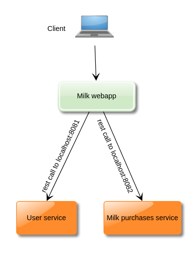
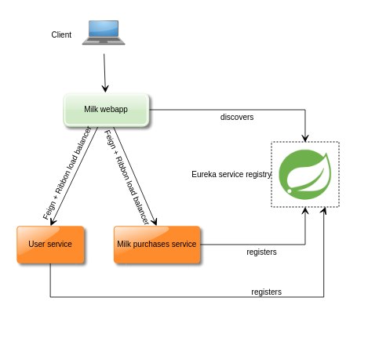
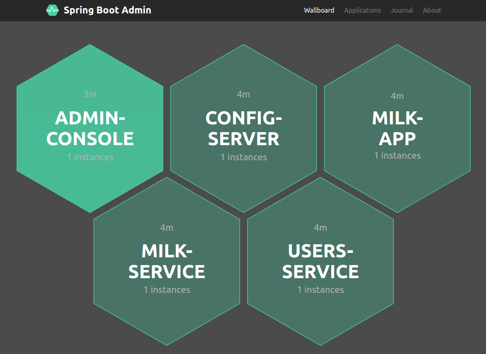
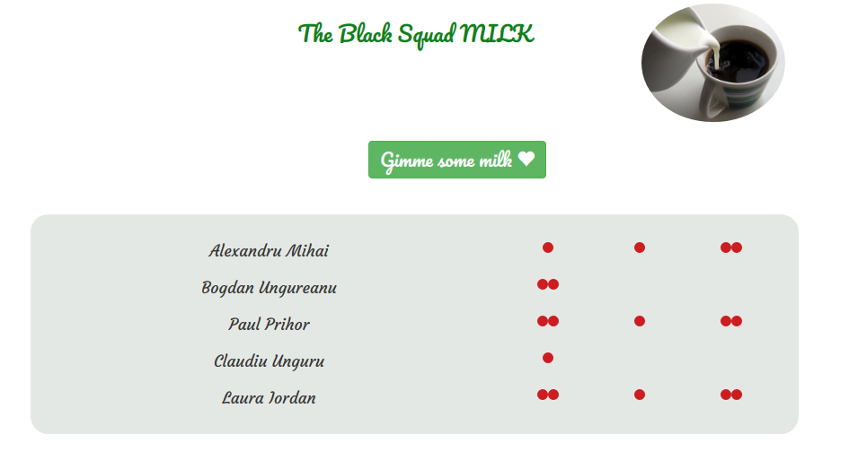

### Milk Application

### Scope:
- Create a simple milk management application for the purpouse of illustrating the usage of spring boot cloud and its components

### Technologies used:
- Spring boot 2.0.6
- Spring cloud
- Eureka Server
- Eureka Discovery client
- Spring config server
- Spring config client
- Spring admin console

### The need:

The inital need was having a simple app that can keep track of people who bought milk
in an office. With that came the idea of splitting this app into 3 parts:

- Users microservice : Holds data about all the users in an office / team
- Milk purchases microservice : Holds all the milk purchases of the users
- The milk app. Calls these 2 microservices and display / manages the user's purchases.

Using spring boot 2, the inital diagram of the app is similar to:

Disadvantages:

- To call the microservice we must know the exact url of the microservices
- If we want to scale the microservices and add multiple nodes, we would also have to know
each node's url and also manage on which node each rest call is made.

##### Registry service to the rescue:

- By using Eureka registry service, together with Netflix feign client, we can register 
all the microservices into Eureka and easily call them by only knowing the microservices id's (This abstraction is handled by Feign client)

 

#### Spring config server:

The spring config server provides support for externalized configurations.
This way, all the *.properties files for the eureka, milk-app, milk-service and users-service cand be externalized to
the config server.

Advantages:

- Having a centralized place for all the environment's apps configuration.
- Apps don't have to be restared in order for the configurations to be reloaded. 
(This is done by calling the /actuator/refresh endpoint exposed by each configured app via spring-boot-config dependency)

#### Spring admin console:

- Registers to Eureka server and retrieves management and health informations about all the registered apps via /actuator endpoints.
Note !!! The actuator endpoints must be enabled and exposed.

### End result:

 
